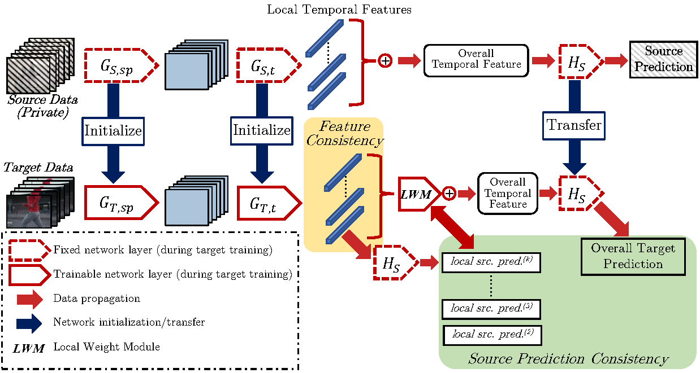

# Attentive Temporal Consistent Network (ATCoN)
This repository is the code for the ECCV 2022 paper "[Source-free Video Domain Adaptation by Learning Temporal Consistency for Action Recognition](https://arxiv.org/abs/2203.04559)". This repository is built based on the [MFNet](https://github.com/cypw/PyTorch-MFNet) repository. We thank the authors of MFNet for their excellent work.



## Prerequisites
This repository is built with PyTorch, with the following packages necessary for training and testing:
```
PyTorch (1.8.0 recommended)
opencv-python (pip)
```
*Note that compatibility towards newer PyTorch versions may NOT be guaranteed*

## Project Detail and Dataset Download
Please visit our [project page](https://xuyu0010.github.io/sfvda.html) to find out details of this work and to download the dataset.

## Training and Testing
There are two steps involved during training: a) training of the source model; b) training of the target model. Note that the source model should be stored properly before the training of the target model.

To train the source dataset, simply run:
```python
python train_source.py
```
To train the source dataset, simply run:
```python
python train_target.py
```
Alternatively, you may train the target model with the SHOT by simply:
```python
python train_target.py --method SHOT
```
To test the trained model on the target domain, change directory to the '/test' folder and run:
```python
python evaluate_target.py
```
You may additionally test the source model on the source domain (to get a glimpse of how the source model performs) by running:
```python
python evaluate_source.py
```

### Notes on training and testing
- The pretrained model where we start our training from is now uploaded to [Gdrive](https://drive.google.com/file/d/1DlBLrG-skHiwJkqD0wGrQkvXnN_dNXnN/view?usp=sharing).
- Notes on the '/exps' folder can be found in the README file in that folder.
- We provide a demo weight [here](https://drive.google.com/file/d/1_dQ2UP_v6SbUCB5Aj_Yw3sd1OhFVjOo0/view?usp=sharing), you should locate it in the '/exps' folder.
- We also provide the train and test log files (in the 'exps/' and 'test/' folders) respectively so that you can check your own training process. Do note that the names may differ a bit.

__If you find this paper interesting and useful, please cite our paper:__
```
@article{xu2022learning,
  title={Learning Temporal Consistency for Source-Free Video Domain Adaptation},
  author={Xu, Yuecong and Yang, Jianfei and Cao, Haozhi and Wu, Keyu and Min, Wu and Chen, Zhenghua},
  journal={arXiv preprint arXiv:2203.04559},
  year={2022}
}
```
